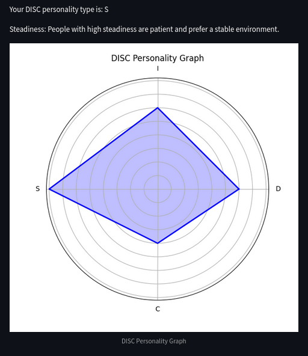

# Behavioral Assessment Application

This is a Streamlit application for behavioral assessment. Users can input various behavioral metrics, and the app displays a summary and visualizations of the input data.

## Installation

1. Clone the repository:
    ```bash
    git clone <repository-url>
    ```
2. Navigate to the project directory:
    ```bash
    cd behavioral-assessment
    ```
    ```
3. Install dependencies:
    ```bash
    pip install -r requirements.txt
    ```
4. Run the application:
   ```bash
    streamlit run src/app.py
    ```
5. Run tests:
    ```bash
    pytest
    ```

## Usage

1. Open the application in your browser.
2. Input the behavioral metrics:
    - Attention Span (minutes)
    - Social Interaction Level (Low, Medium, High)
    - Activity Level (1-10)
3. View the summary and visualizations of the input data.
4. Click "Generate Report" to finalize the assessment.

## DISC Personality Test

The DISC personality test is now available in the application. This test helps classify personality types based on four traits: Dominance, Influence, Steadiness, and Conscientiousness.



### How to Use:
1. Navigate to the DISC test page.
2. Answer the questions presented.
3. Submit your answers to receive your DISC personality type, a detailed explanation, and a visual graph.
